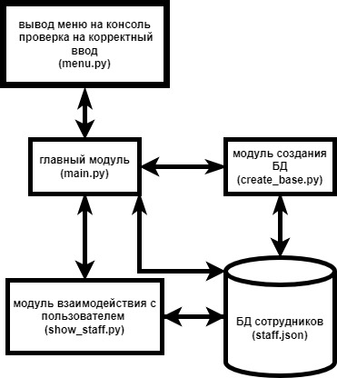

# Задача:
## создать информационную систему, позволяющую работать с сотрудниками некой компании \ студентами вуза \ учениками школы. Обязательно наличие внешнего хранилища информации в виде или текстового файла, или файла .json.

# Схема модульной архитектуры приложения:

### [Алексей Валентинов](https://github.com/xDOKBETx)
Настроены связи между модулями. Реализованы модули main.py, menu.py, README.md

### [Андрей Журавлев](https://github.com/andrik-150) 
Проработаны модули create_base.py, show_staff.py

